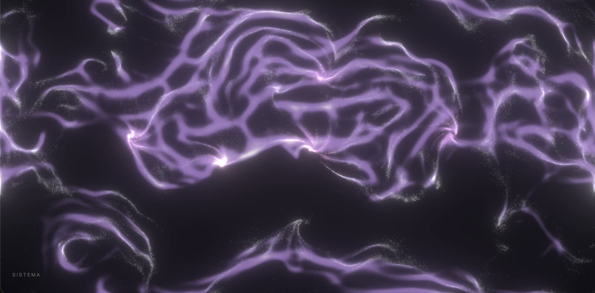

# Contemplar lo infinito

Instrumento visual en tiempo real para interpretar el tema principal de *Interstellar*
(Hans Zimmer, versión Original Score de Imperial Orquesta).

Una intérprete escucha la música y, con pocos controles, modifica las condiciones de un
universo de agentes autónomos. Los agentes nunca se mueven por orden directa: perciben su
entorno inmediato y deciden su movimiento. Las formas que aparecen (grupos, corrientes,
filamentos, nubes, cuerpos) emergen de esas decisiones locales.

La pieza no representa el espacio. Busca transmitir **la sensación de contemplar algo inmenso
que no se puede comprender del todo**.

- **Sitio en vivo:** https://valengp2006.github.io/contemplar-lo-infinito/ (Chrome o Edge
  actualizado; necesita WebGPU).
- **Bitácora del proceso:** [`docs/bitacora.md`](docs/bitacora.md)
- **Evidencias (imágenes):** [`docs/evidencias/`](docs/evidencias/)
- **Especificación:** [`AGENTS.md`](AGENTS.md),
  [`docs/prototipo-1-especificacion.md`](docs/prototipo-1-especificacion.md),
  [`docs/funcionalidad-completa.md`](docs/funcionalidad-completa.md)

[](docs/evidencias/ensayo-2026-10-01.mp4)

**▶ [Video de un ensayo completo](docs/evidencias/ensayo-2026-10-01.mp4)** (6:39, con la
música; 1 de octubre de 2026). Entre 5:00 y 5:05 aparece por accidente el menú de emojis de
macOS: es un error de la grabación, no de la obra.

---

## Cómo ejecutarlo

```bash
npm install
npm run dev          # abre http://localhost:5173 en Chrome
npm run build        # versión para publicar (dist/)
npm run gpu-check    # banco de pruebas: ejecuta los shaders reales y genera una imagen
```

Variantes del banco de pruebas: `N=20000 npm run gpu-check` (cantidad fija de agentes) y
`LEVEL=4 npm run gpu-check` (un nivel de REVELACIÓN). La imagen queda en
`tools/out/gpu-check.png`.

## Controles

**Interpretación.** Ningún control mueve una partícula: todos modifican el **entorno**, y los
agentes lo perciben.

| Control | Entrada | Qué cambia del entorno | Significado |
|---|---|---|---|
| RUMBO local | Mover el mouse | Curva y gira la corriente cerca del recorrido; se relaja en ~2 s | Viaje |
| RUMBO global | Rueda o dos dedos | Gira la deriva lenta de todo el campo | Transformación |
| ATRACCIÓN | Mantener clic | Crea un pozo suave que crece mientras se mantiene | Búsqueda, deseo |
| MEMORIA | ↑ / ↓ | Persistencia de la huella Physarum (0,4–25 s) | Recuerdo, nostalgia |
| PULSO | Barra espaciadora | Una onda anular que cruza la pantalla en ~6 s | Tiempo, pérdida |
| REVELACIÓN | R / Shift+R | Nivel de complejidad 0–4, con transición de ~15 s | Descubrimiento |
| CUERPO | 4 | Un centro de gravedad invisible en el cursor; los agentes forman un núcleo | Materia que se reúne |
| SISTEMA | 5 | Los cuerpos sueltos se reúnen y se orbitan | Relación, órbita |
| DISOLVER | 6 (también 1–3) | Los cuerpos estallan: un empujón hacia afuera y su materia vuelve al polvo | Desaparición |
| FINAL | E | Descenso de ~40 s hasta un único punto de luz | Despertar |

**Sesión:**
- clic en la pantalla de inicio: comienza la pieza y la música;
- F: pantalla completa;
- P: pausa la música y la simulación.

**Desarrollo** (no se usan al presentar):
- M: modo desarrollo, con métricas y panel de ajuste;
- T: muestra u oculta el panel;
- D: muestra los fps;
- 1–3: fijan la cantidad de agentes.

En modo performance el cursor no se ve y solo aparece, tenue, el nombre del control usado.

## Score de interpretación

Es una guía de ensayo, no una sincronización: **el sistema nunca analiza la música**.

| Sección musical | Nivel | Acciones |
|---|---|---|
| Inicio, calma | 0 | No tocar, o RUMBO mínimo |
| Primer crecimiento, curiosidad | 1 | R; mover el mouse suavemente |
| Emergencia, asombro | 2 | R; primeros CUERPOS (4) |
| Cambio de dirección, nostalgia | 2 → 3 | MEMORIA ↑ (las huellas persisten); reunir los cuerpos en un SISTEMA (5) |
| Aumento de intensidad, emoción | 3 | R; ATRACCIÓN y RUMBO |
| El pulso | 3 | PULSO con la barra espaciadora, al ritmo que decido al escuchar |
| Clímax, sobrecogimiento | 4 | R; combinar RUMBO, ATRACCIÓN y MEMORIA |
| Descenso, contemplación | 4 → 0 | Shift+R escalonado, DISOLVER (6) y soltar controles |
| Final | 0 | E: queda un único punto de luz |

## Cómo funciona

**Cada agente** tiene posición, velocidad, velocidad máxima y fuerza máxima, con una
variación individual de ±15 %. Además tiene una "cercanía" fija que da profundidad sin 3D:
casi todos son polvo lejano, pequeño, tenue y más lento.

**Qué percibe un agente.** Solo su entorno inmediato; nunca conoce el universo completo:

1. la dirección del **flow field** en su posición: corrientes sin sumideros que evolucionan,
   más la deriva global y la perturbación del mouse;
2. la **densidad** y la **velocidad media** de sus vecinos, en un radio de ~6 % del alto de la
   pantalla;
3. la **huella Physarum**, con tres sensores (izquierda, centro, derecha);
4. si está dentro de un **pozo de atracción**, de un **cuerpo** o del frente de un **pulso**.

**Cómo calcula su acción.** Cada regla produce una fuerza de steering de Reynolds:
*velocidad deseada − velocidad actual*, limitada por la fuerza máxima.

| Regla | Velocidad deseada |
|---|---|
| Flow field | La dirección de la corriente |
| Alineación | La velocidad media de los vecinos |
| Cohesión | Hacia donde hay más vecinos (subir por el gradiente de densidad) |
| Separación | Alejarse si la zona supera 1,5 veces la densidad media |
| Physarum | Girar hacia el sensor con más huella |
| Atracción y cuerpos | Hacia el centro, curvándose; dentro del núcleo, asentarse |
| Wander | Una dirección propia que cambia lentamente (incertidumbre individual) |

Las fuerzas se suman, se limitan y se integran: **fuerza → aceleración → velocidad →
posición**. Por eso los agentes se curvan y nunca giran de golpe. Después, cada agente deja
una huella en el mapa de memoria, que se difunde y se desvanece según la MEMORIA.

**Cadena de comportamiento:** flow field (rumbo del universo) → flocking (conexión) →
steering (decisiones) → Physarum (memoria). Así, los cuatro algoritmos forman una sola
cadena y no cuatro efectos separados.

**Decisión técnica.** El flocking no compara cada agente con cada vecino. Los agentes
depositan su presencia y su velocidad en un mapa (una rejilla suave), y cada uno lee ese mapa
a su alrededor, descontando su propia contribución. Esto permite cientos de miles de agentes
en tiempo real. Todo corre en la GPU con WebGPU y Three.js 0.185.1, en 7 programas de
cómputo por cuadro. El código está en `src/` (estructura en `AGENTS.md`, sección 23).

---

## Autoevaluación (Actividad 04)

> Puntajes decididos por la autora; se sustentan durante la presentación. Los ensayos con la
> música están en la tabla "Registro de ensayos" de la [bitácora](docs/bitacora.md).
>
> **Ensayos:** el 1 de octubre se hicieron 4 ensayos en vivo de la pieza completa, con todos los
> controles, y funcionaron bien. Después del ajuste de los cuerpos se grabó un ensayo completo:
> [video](docs/evidencias/ensayo-2026-10-01.mp4).

| Criterio | Puntaje | Resumen |
|---|---|---|
| 1. Cumplimiento del encargo | 25 / 25 | Web, tiempo real (120 fps con 200.000 agentes), publicado; la pieza completa se interpretó en vivo en 4 ensayos |
| 2. Comprensión y verificación | 25 / 25 | Sistema documentado agente por agente; cinco predicciones verificadas con mediciones |
| 3. Diseño e intención | 25 / 25 | Cada algoritmo tiene un papel ligado a la música; las decisiones se ajustaron comparando el resultado con la intención |
| 4. Interpretación humana | 25 / 25 | Score por sección y controles continuos y puntuales; 4 ensayos en vivo; el instrumento se ajustó según lo observado al tocar |
| **Total** | **100 / 100** | |

### 1. Cumplimiento del encargo — 25 / 25

*Mi instrumento utiliza tecnología web, funciona en tiempo real y permite interpretar la pieza
musical elegida.*

- **Tecnología web.** Three.js 0.185.1 con WebGPU, en el navegador. Está publicado en GitHub
  Pages y se despliega solo con cada cambio en `main`. El sitio en vivo usa el mismo archivo de
  build que la versión actual del código.
- **Tiempo real.**
  - En la Mac de la autora corre a 120 fps, el tope de la pantalla, incluso con 200.000
    agentes (medido con el contador de fps del modo desarrollo).
  - En el banco de pruebas, la simulación de 200.000 agentes con huella, cuerpos y pulsos
    toma ~1,8 ms por paso, menos del 15 % del tiempo disponible a 60 fps.
- **Interpreta la pieza.**
  - La autora tocó la pieza completa en vivo en **4 ensayos** (1 de octubre), con todos los
    controles, y el sistema funcionó bien ([registro de ensayos](docs/bitacora.md)).
  - La música suena de fondo desde el clic de inicio.
  - El recorrido emocional de la obra está traducido en niveles y controles (ver el score).
  - El sistema nunca analiza el audio: la intérprete escucha y decide.
- **Evidencias:** [`05-nivel4-nebulosa.jpg`](docs/evidencias/05-nivel4-nebulosa.jpg),
  [`04-modo-desarrollo.jpg`](docs/evidencias/04-modo-desarrollo.jpg) (métricas a 120 fps).
- **Por qué 25:** se cumplen las tres condiciones del encargo, con evidencia de cada una. El
  único defecto conocido, en los bordes, es pequeño y en los ensayos se integró en la
  interpretación sin afectarla (ver "Limitaciones conocidas").

### 2. Comprensión y verificación — 25 / 25

*Puedo explicar cómo está construido el sistema, qué perciben los agentes y cómo calculan sus
acciones. Puedo predecir y verificar los cambios al modificar un parámetro.*

- Lo que percibe cada agente y cómo calcula su acción está descrito arriba, en **Cómo
  funciona**.
- **Predicciones verificadas con el banco de pruebas**, que ejecuta los mismos shaders del
  navegador y mide velocidad, valores inválidos y acumulación en los bordes:

| Cambio | Predicción | Resultado medido |
|---|---|---|
| Apagar la cohesión | Los agentes irán más rápido, porque la cohesión los frenaba en los grupos | La velocidad media sube de 0,0089 a 0,0125 (+40 %) |
| Dejar solo el flow field | Los agentes se acumularán en los bordes, porque las corrientes no empalman | 18,5 % de los agentes en los bordes (lo esperado es ~4 %) — [`11`](docs/evidencias/11-prueba-bordes-solo-flow.png) |
| Apiñamiento relativo a la densidad media | El flocking se comportará igual con cualquier cantidad de agentes | Velocidad media de 0,0082 a 0,0085 con 5k, 20k, 80k y 200k; desaparecen las líneas de la rejilla — [`02`](docs/evidencias/02-saturacion-antes-despues.png) |
| Medir la huella respecto a una memoria fija | Con memoria larga la huella se acumulará y brillará más | Memoria baja: solo polvo; alta: bruma violeta y azul — [`08`](docs/evidencias/08-memoria-baja-media-alta.png) |
| Cuerpos más lentos que los agentes | La materia podrá seguir a los cuerpos y el sistema será visible | Con velocidad 0,015 (por debajo del 0,035 de los agentes) se ven tres núcleos que se orbitan — [`10`](docs/evidencias/10-sistema-de-cuerpos.jpg) |

- El panel del modo desarrollo permite cambiar cualquier parámetro en vivo y observar el
  efecto.
- **Por qué 25:**
  - cada cambio importante se hizo prediciendo su efecto y midiéndolo antes de aceptarlo;
  - las decisiones técnicas están justificadas por escrito, incluido el flocking por campos en
    lugar de vecinos individuales (ver "Decisión técnica" y la [bitácora](docs/bitacora.md)).

### 3. Diseño e intención — 25 / 25

*Puedo justificar la selección y combinación de comportamientos y relacionarlos con mi
interpretación musical.*

**Cada algoritmo tiene un papel conceptual:**

| Algoritmo | Papel |
|---|---|
| Flow field | El rumbo del universo; viaje y corrientes invisibles |
| Flocking | La conexión y la pertenencia |
| Steering | Las decisiones individuales, la búsqueda (atracción) y la incertidumbre (wander) |
| Physarum | La memoria y la nostalgia: huellas que persisten |

**El arco de la música se traduce en estados visuales:**

| Música | Imagen |
|---|---|
| Calma | Pocas presencias |
| Curiosidad | Grupos |
| Asombro | Corrientes |
| Nostalgia | Huellas persistentes |
| Clímax | Inmensidad, color y resplandor |
| Final | Un único punto, como al inicio |

Evidencia: [`07-revelacion-niveles.png`](docs/evidencias/07-revelacion-niveles.png).

**Decisiones de diseño que salieron de mirar el resultado y compararlo con la intención:**
- *"Debe sentirse como un espacio exterior vivo que respira"* → se eliminó la saturación
  ([`01`](docs/evidencias/01-saturacion-200k-antes.jpg) →
  [`03`](docs/evidencias/03-calibracion-progresion.png)).
- *"Se ve biológico, no como el espacio"* → profundidad, escala, filamentos y color por
  comportamiento.
- *Cuerpos celestes* → núcleos que emergen de los agentes, no dibujados, para respetar la
  regla de no literalidad ([`09`](docs/evidencias/09-cuerpos.png)).

**El color depende del comportamiento:**
- violeta en los agentes rápidos;
- magenta en las concentraciones;
- dorado solo en el clímax.

La paleta no cambia de colores a lo largo de la pieza: cambia la **cantidad** de color.

**Por qué 25:**
- la combinación de comportamientos forma una sola cadena con sentido musical;
- cada cambio visual se decidió comparando el resultado con la intención de la obra;
- en los ensayos, la calibración de color funcionó bien.

### 4. Interpretación humana — 25 / 25

*Mi score y mis controles permiten conducir el sistema en vivo y responder a su
comportamiento.*

- **Score:** una tabla por sección musical con el nivel y las acciones (ver arriba).
- **Controles:**
  - **Continuos:** RUMBO, ATRACCIÓN y MEMORIA, para responder a lo que hace el sistema en
    cada momento.
  - **Puntuales:** PULSO, REVELACIÓN, CUERPO, SISTEMA, DISOLVER y FINAL, para los momentos
    clave de la música.
- **Todo cambio es suave:**
  - la revelación tarda ~15 s;
  - la atracción crece y se libera;
  - los cuerpos se forman y se disuelven.

  Así se puede intervenir en vivo sin saltos bruscos.
- **El sistema sigue vivo sin tocarlo.** RUMBO y ATRACCIÓN vuelven solos a neutro, y la
  intérprete reacciona a lo que emerge.
- **El modo performance deja la pantalla limpia.** Sin cursor ni paneles; solo el nombre del
  control, tenue, durante unos segundos.
- **Evidencias:** [`06-pulso-reorganizacion.jpg`](docs/evidencias/06-pulso-reorganizacion.jpg)
  (efecto del pulso) y [`10-sistema-de-cuerpos.jpg`](docs/evidencias/10-sistema-de-cuerpos.jpg).
- **Ensayos:** 4 ensayos en vivo de la pieza completa (1 de octubre), con todos los controles.
  El sistema respondió bien y la calibración de color funcionó. Los pequeños defectos de los
  bordes se integraron en la interpretación.
- **Respuesta a lo observado al tocar:** tras los ensayos, la autora pidió que los cuerpos
  se formaran más rápido y fueran más grandes, y que la dispersión fuera más impactante. El
  instrumento se ajustó en consecuencia
  ([evidencia](docs/evidencias/12-cuerpo-formacion-y-estallido.png)).
- **Por qué 25:** el score y los controles permitieron conducir la pieza completa en vivo en
  4 ensayos, y el instrumento evolucionó a partir de lo que la intérprete observó al tocar.
- **Ensayo grabado:** la pieza completa con la música, después del ajuste de los cuerpos
  ([video, 6:39](docs/evidencias/ensayo-2026-10-01.mp4);
  [fotograma del clímax](docs/evidencias/13-ensayo-climax.jpg)). Entre 5:00 y 5:05 aparece por
  accidente el menú de emojis de macOS; es un error de la grabación, no del instrumento.

---

## Limitaciones conocidas

- **Requiere WebGPU** (Chrome o Edge actualizados). No hay alternativa en WebGL, por decisión
  del proyecto.
- **Bordes:** las corrientes no empalman donde el espacio se envuelve, y entre 5 % y 7 % de
  los agentes quedan cerca de los bordes. En los ensayos fue un defecto pequeño que se integró
  en la interpretación.
- **Física simplificada a propósito:** los cuerpos celestes son centros de gravedad
  invisibles que mueve el instrumento, no una simulación física.

## Créditos

- **Concepto, diseño, dirección visual e interpretación:** Valentina Garzón Pérez.
- **Implementación:** asistida por agentes de código (Claude), con las decisiones de diseño
  tomadas por la autora. El proceso está documentado en la [bitácora](docs/bitacora.md).
- **Música:** tema principal de *Interstellar* (Hans Zimmer), versión Original Score de
  Imperial Orquesta. Uso académico.
- **Tecnología:** [Three.js](https://threejs.org/) 0.185.1 (WebGPU, TSL) y
  [Vite](https://vite.dev/).
